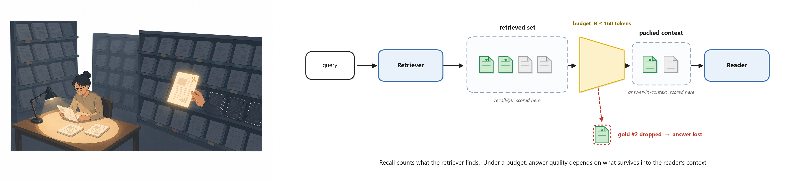
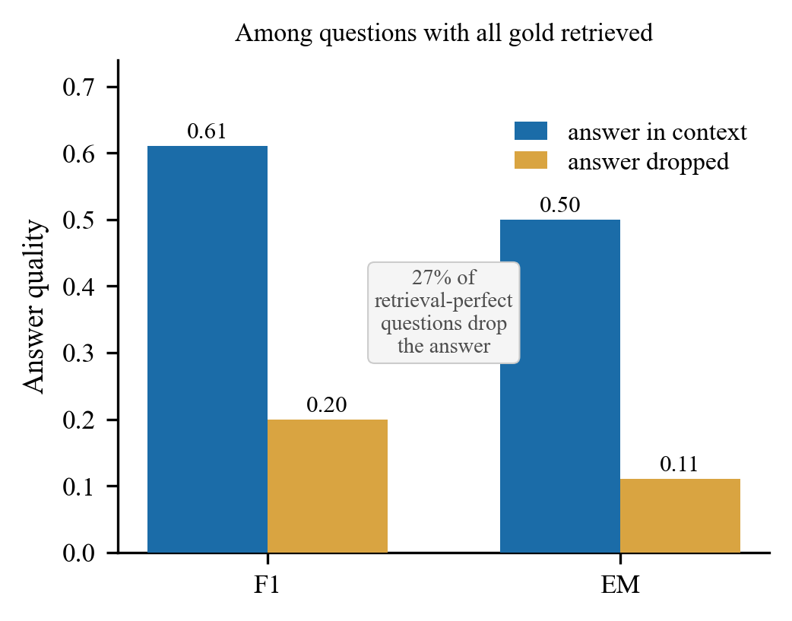
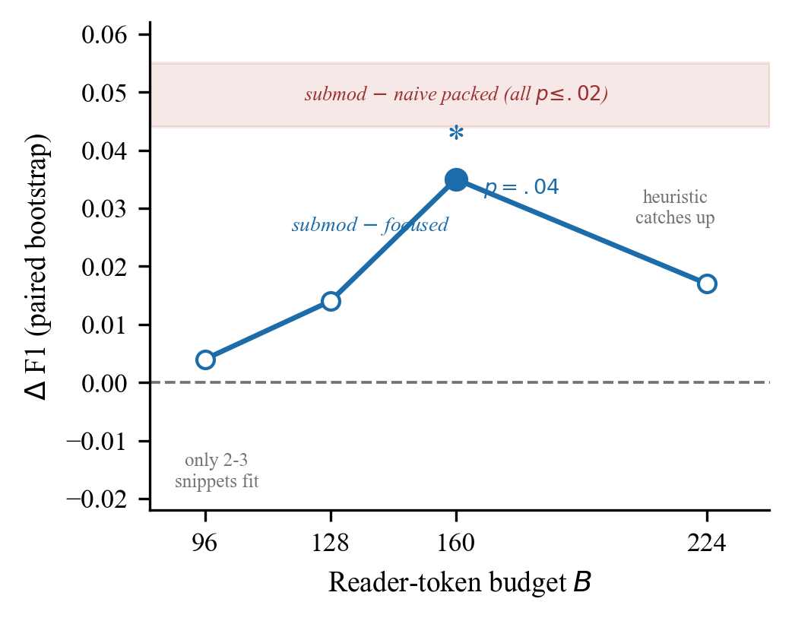
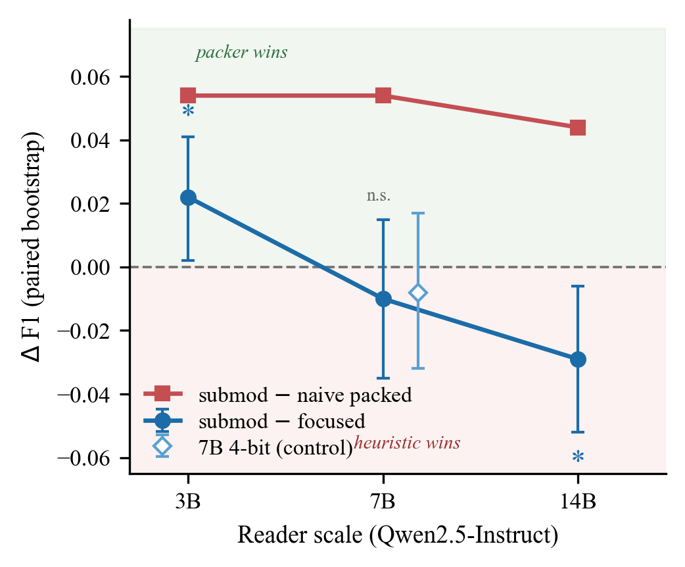

<div align="center">



# 🎯 What Survives Into Context

### A Diagnostic for Budget-Constrained Multi-Hop RAG

[](https://arxiv.org/abs/2607.00725)
[](https://www.python.org/)
[](https://pytorch.org/)

*When does packing evidence smartly beat grabbing the top snippets — and how do you even measure it?*

</div>

---

> **TL;DR** — Retrieval recall measures what you *found*. Under a tight reader-context
> budget, the reader only ever sees a fraction of it. We show that **whether the answer
> survives into that fraction** (*answer-in-context*) predicts quality far better than
> recall (r = 0.50 vs 0.31), and build a budgeted submodular packer that exploits this —
> winning when four conditions hold, and honestly reporting where it doesn't.

---

## 📊 The Headline Finding

RAG under a fixed reader-context budget forces a selection problem: only a fraction of
what's retrieved can be shown to the reader. The proposed **answer-in-context (AiC)**
diagnostic measures exactly what survives that squeeze — and it explains a mystery that
recall alone cannot: why higher recall doesn't reliably mean better answers.

| Reader scale | `submod − focused` ΔF1 | Verdict |
|:---:|:---:|:---|
| **3B**  | **+0.022** (p < 0.05) | ✅ packer wins |
| 7B      | −0.010 (n.s.) | ➖ advantage absorbed |
| 14B     | −0.029 (p = 0.013) | 🔄 reverses |

*The packer keeps packing more gold at every scale — but once the reader is capable
enough to dig the answer out on its own, the packer's small distractor overhead becomes
a liability instead of a help.*

<details>
<summary><b>▶ When does the packer actually help? (four-condition scope map)</b></summary>

The win is **conditional on all four holding at once**:

1. **Multi-hop, complementary structure** — single-pass questions get no benefit
2. **Retrieval surfaces the evidence** — can't pack what was never retrieved (MuSiQue: all-gold@5 = 0.18 → no win)
3. **Budget binding, but not extreme** — too tight (96 tok) and nothing complementary fits; too loose (224 tok) and the heuristic catches up
4. **Reader is the bottleneck** — a strong enough reader (14B) stops needing the completeness

</details>

---

## 🖼️ Results at a Glance

<p align="center">
  
  
  
</p>
<p align="center"><sub><b>Left:</b> AiC incremental validity — answer survives vs. dropped, retrieval held perfect &nbsp;·&nbsp;
<b>Center:</b> budget sweep — the packer's edge is an inverted-U, peaking at B≈160 &nbsp;·&nbsp;
<b>Right:</b> reader-scale ladder — absorbed at 7B, reverses at 14B</sub></p>

---

## 📦 Repository Structure

```
ace_rag/                    # Core package
  evidence_packer.py         Budgeted submodular packer (the method)
  context_quality.py         AiC diagnostic metrics
  datasets.py                HotpotQA, MuSiQue, 2Wiki, RAGBench loaders
  generator.py                Reader LLM interface (Qwen2.5)
  retriever.py                Dense retrieval wrapper
  schema.py / metrics.py      Data structures and evaluation

experiments/
  run_density_router.py       Main experiment runner (all paper experiments)
  run_qwen_eval.py             Baseline runner (early-stage heuristics)

configs/                     YAML configs — hotpotqa / musique / ragbench

scripts/
  pool_multiseed_bootstrap.py     Paired bootstrap significance testing
  incremental_validity_aic.py     AiC incremental validity analysis (§3.3)
  analyze_density_results.py      Result aggregation
  bootstrap_stage3_significance.py

paper_results/                All result CSVs, organized by experiment
  hotpotqa_3seed_3b/           Table 3 — main win (3B reader, seeds 42/13/7)
  hotpotqa_budget_sweep/       Table 5 / Fig — budget sweep (96/128/224)
  musique_ablation/            Table 4 — MuSiQue retrieval ablation
  reader_ladder_7b_fp16/       Table 6 — 7B fp16
  reader_ladder_7b14b_4bit/    Table 6 — 7B 4-bit + 14B 4-bit
  2wiki_interventional/        Appendix C — 2Wiki interventional check

figures/                     make_figures.py + all paper PNGs
```

---

## 🚀 Quickstart

```bash
pip install -r requirements.txt
```

Key dependencies: `torch`, `transformers`, `bitsandbytes`, `sentence-transformers`, `datasets`.
7B/14B readers need 2× NVIDIA T4 or equivalent (16GB+ VRAM total); 3B fits on one.

<details>
<summary><b>▶ Reproduce the main result (Table 3)</b></summary>

```bash
# HotpotQA, 3B reader, budget 160, seed 42
python experiments/run_density_router.py \
    --config configs/hotpotqa.yaml \
    --budget 160 --seed 42 --limit 500 \
    --reader Qwen/Qwen2.5-3B-Instruct \
    --output_dir results/hotpotqa_seed42

# Repeat for seeds 13 and 7, then pool:
python scripts/pool_multiseed_bootstrap.py \
    --dirs results/hotpotqa_seed42 results/hotpotqa_seed13 results/hotpotqa_seed7 \
    --policy_a chunk_submod --policy_b chunk_focused
```

Expected: `chunk_submod` vs `chunk_focused` ΔF1 ≈ **+0.022** (p < 0.05).

</details>

<details>
<summary><b>▶ Reproduce the reader-scale ladder (Table 6)</b></summary>

```bash
# 7B fp16 (2x T4 required)
python experiments/run_density_router.py \
    --config configs/hotpotqa.yaml --budget 160 --seed 42 --limit 500 \
    --reader Qwen/Qwen2.5-7B-Instruct --output_dir results/hotpotqa_7b_fp16

# 14B 4-bit (2x T4, nf4 quantization)
python experiments/run_density_router.py \
    --config configs/hotpotqa.yaml --budget 160 --seed 42 --limit 500 \
    --reader Qwen/Qwen2.5-14B-Instruct --load_in_4bit \
    --output_dir results/hotpotqa_14b_4bit
```

Expected: packer advantage absorbed at 7B, reverses (−0.029, p = 0.013) at 14B.

</details>

<details>
<summary><b>▶ Verify results without re-running anything</b></summary>

All raw per-question CSVs live in `paper_results/`:

```bash
python scripts/analyze_density_results.py --dir paper_results/hotpotqa_3seed_3b
python scripts/pool_multiseed_bootstrap.py --dir paper_results/hotpotqa_3seed_3b
```

</details>

<details>
<summary><b>▶ Regenerate the figures</b></summary>

```bash
cd figures && python make_figures.py
```

Writes `reader_ladder.png`, `aic_validity.png`, `budget_sweep.png` at 300 dpi.

</details>

---

## 🗂️ Datasets

Loaded automatically via HuggingFace `datasets`:

| Dataset | Source | Note |
|---|---|---|
| HotpotQA | `hotpotqa/hotpotqa` | distractor setting |
| MuSiQue | `Sefika/musique` or local JSONL | see `configs/musique_local.yaml` |
| 2WikiMultiHopQA | `conviction-bench/2wikimultihopqa` | — |
| RAGBench | `rungalileo/ragbench` | CovidQA / ExpertQA, use `--split test` |

---

## 🖥️ Hardware

All experiments ran on **2× Tesla T4** (15 GB each) via Kaggle.

| Reader | Requirement |
|---|---|
| 3B | single T4 |
| 7B fp16 | 2× T4, `device_map=auto` |
| 14B 4-bit | 2× T4, `load_in_4bit=True` (bitsandbytes nf4) |

---

## 📄 Citation

```@misc{bala2026survivescontextdiagnosticbudgetconstrained,
      title={What Survives Into Context: A Diagnostic for Budget-Constrained Multi-Hop RAG and When Submodular Evidence Packing Improves It}, 
      author={Ananto Nayan Bala},
      year={2026},
      eprint={2607.00725},
      archivePrefix={arXiv},
      primaryClass={cs.CL},
      url={https://arxiv.org/abs/2607.00725}, 
}
```

*(update `author` with your name)*
